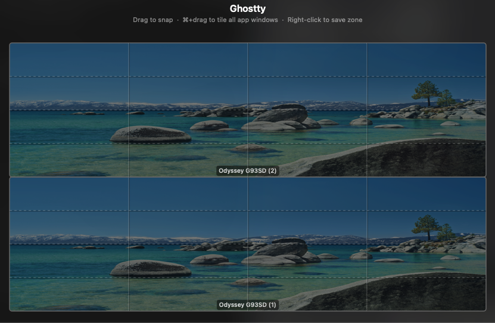
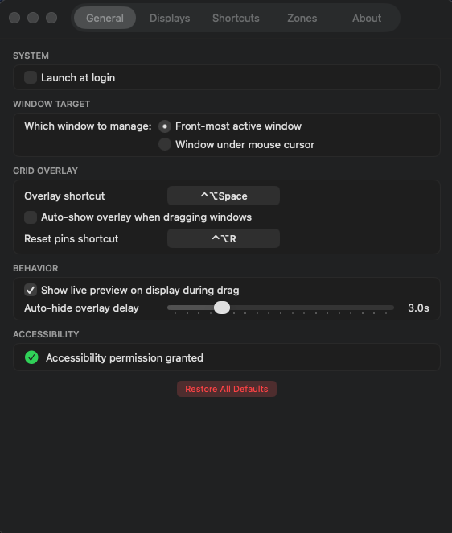
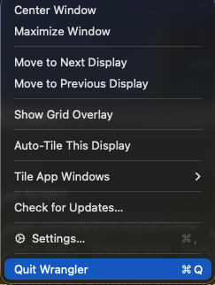

# Wrangler

A macOS window manager that snaps windows to configurable grids, tiles app windows with one click, and keeps your desktop organized across multiple displays.

Built for power users who live in terminals and need fast, keyboard-driven window management.



| Settings | Menu Bar |
|----------|----------|
|  |  |

## Download

Grab the latest DMG from [Releases](https://github.com/jgaddis99/wrangler/releases). Drag Wrangler to Applications, launch it, and grant Accessibility permission when prompted.

Wrangler lives in your menu bar and checks for updates automatically.

## Quick Start

1. **Launch Wrangler** — it appears as a grid icon in your menu bar
2. **Grant Accessibility permission** — required for window management (System Settings > Privacy & Security > Accessibility)
3. **Try it** — focus any window and press `Ctrl+Alt+Right Arrow` to snap it to a grid cell

That's it. Keep pressing the arrow to move it across the grid. Hit `Ctrl+Alt+Space` to open the visual overlay for drag-based snapping.

## How It Works

### Grid Movement

Every display has a configurable grid (default 4 columns x 3 rows). Use keyboard shortcuts to move and resize windows within the grid.

| Shortcut | What it does |
|----------|-------------|
| `Ctrl+Alt+Arrow` | Snap to one grid cell, move in that direction |
| `Ctrl+Alt+Shift+Arrow` | Grow the window one cell in that direction |
| `Ctrl+Alt+U` / `I` / `J` / `K` | Snap to quarter (keys form a 2x2 on your keyboard) |
| `Ctrl+Alt+1` / `2` / `3` | Snap to left / center / right third |
| `Ctrl+Alt+Enter` | Maximize |
| `Ctrl+Alt+C` | Center on current display |
| `Ctrl+Alt+Z` | Undo last snap |
| `Ctrl+Cmd+Left` / `Right` | Move to previous / next display |

When you reach the edge of a display, the arrow keys wrap to the adjacent monitor.

### Visual Grid Overlay

Press `Ctrl+Alt+Space` to open the overlay. It shows all your displays with wallpaper backgrounds and grid lines.


**Drag** across grid cells to select a zone — the window snaps on release. A live preview highlights exactly where it will land on your actual monitor.

**Cmd+Drag** to batch-tile — all windows of the focused app (e.g., all your terminals) tile evenly into the selected zone.

**Right-click drag** to save a custom zone with a name and keyboard shortcut. Manage saved zones in Settings > Zones.

### Auto-Tile

Press `Ctrl+Alt+T` to auto-tile every visible window on the current display into an optimal grid. Works great for quickly organizing a messy desktop.

Also available from the menu bar: **Tile App Windows > Tile on [Display Name]** tiles all windows of the frontmost app on a specific monitor.

### App Pinning

Pin apps like Slack, Mail, or Discord to fixed positions. When things get messy, press `Ctrl+Alt+R` to reset all pinned apps back to their spots.

1. Open Settings > Zones
2. Focus the app you want to pin
3. Click "Pin Current App"
4. Position the app where you want it

### Settings

Access Settings from the menu bar icon. Configure per-display grids, customize all shortcuts, manage saved zones and pinned apps.

**Displays** — set columns, rows, and gap per monitor. The grid preview shows your wallpaper with the grid overlay.

**Shortcuts** — every shortcut is customizable. Click "Record Shortcut" and press your preferred key combination.

**Zones** — view, rename, rebind, or delete saved custom zones. Also manage pinned apps here.

## Keyboard Reference

All shortcuts use `Ctrl+Alt` as the base modifier. This maps to the same physical keys on both Mac keyboards and Windows/PC keyboards (when docked).

| Category | Shortcut | Action |
|----------|----------|--------|
| **Move** | `Ctrl+Alt+Arrow` | Move window one grid cell |
| **Grow** | `Ctrl+Alt+Shift+Arrow` | Extend window one cell |
| **Quarters** | `Ctrl+Alt+U/I/J/K` | Snap to quarter |
| **Thirds** | `Ctrl+Alt+1/2/3` | Snap to third (ultrawide) |
| **Actions** | `Ctrl+Alt+Enter` | Maximize |
| | `Ctrl+Alt+C` | Center |
| | `Ctrl+Alt+T` | Auto-tile display |
| | `Ctrl+Alt+Z` | Undo last snap |
| **Overlay** | `Ctrl+Alt+Space` | Open grid overlay |
| **Pins** | `Ctrl+Alt+R` | Reset all pinned apps |
| **Display** | `Ctrl+Cmd+Left/Right` | Move to other display |

## Why Wrangler?

I built Wrangler because I couldn't find a window manager that did what I needed. I run two stacked ultrawide monitors with a dozen Ghostty terminals, multiple browsers, and apps scattered everywhere. I needed something that could snap windows to a grid fast, batch-tile all my terminals at once, and work equally well with my Mac keyboard and the Windows keyboard I use when docked.

That last part matters more than you'd think. Most Mac window managers use `Cmd` as the primary modifier, which maps to the Windows key on a PC keyboard — awkward and inconsistent. Wrangler uses `Ctrl+Alt` for everything, which hits the same physical keys on both keyboards. If you switch between Mac and PC keyboards throughout the day, this just works.

### Mac vs Windows Keyboard Mapping

| Wrangler Shortcut | Mac Keyboard | Windows/PC Keyboard |
|-------------------|-------------|-------------------|
| `Ctrl+Alt+Arrow` | `⌃⌥Arrow` | `Ctrl+Alt+Arrow` |
| `Ctrl+Alt+Shift+Arrow` | `⌃⌥⇧Arrow` | `Ctrl+Alt+Shift+Arrow` |
| `Ctrl+Alt+Space` | `⌃⌥Space` | `Ctrl+Alt+Space` |
| `Ctrl+Cmd+Arrow` | `⌃⌘Arrow` | `Ctrl+Win+Arrow` |

Same physical keys, same muscle memory, no matter which keyboard is plugged in.

## Requirements

- macOS 14.0 (Sonoma) or later
- Accessibility permission

## Building from Source

```bash
# Clone
git clone https://github.com/jgaddis99/wrangler.git
cd wrangler

# Create local signing config
echo 'DEVELOPMENT_TEAM = YOUR_TEAM_ID' > Local.xcconfig

# Build and run
just build

# Run tests
just test

# Build DMG
just dmg
```

Find your team ID: `security find-identity -v -p codesigning | grep "Apple Development"`

Requires [xcodegen](https://github.com/yonaskolb/XcodeGen) (`brew install xcodegen`) and Xcode 15+.

## Support

If Wrangler saves you time, consider supporting development:

[Donate via PayPal](https://paypal.me/jgaddis99)

## License

[MIT](LICENSE)
